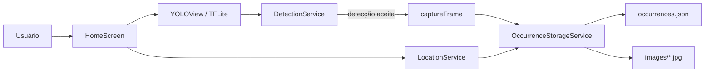

# Design — Dashcam MVP

## Visão geral

O aplicativo possui uma única tela. `YOLOView` controla câmera e inferência; serviços Dart pequenos filtram resultados, acompanham GPS e persistem ocorrências.



## Estrutura de código

```text
lib/
  config/app_config.dart
  models/pothole_occurrence.dart
  screens/home_screen.dart
  services/detection_service.dart
  services/location_service.dart
  services/occurrence_storage_service.dart
  main.dart
```

## Componentes

### `AppConfig`

Centraliza caminho do modelo, confiança `0.5`, alvo de 5 FPS, cooldown de 3 segundos, idade máxima do GPS em cache e classes aceitas.

### `HomeScreen`

É responsável por permissões, ciclo de vida da sessão, montagem do `YOLOView`, wakelock, contador e mensagens da UI. Operações de foto/GPS/disco são serializadas com `_isSavingDetection`.

### `DetectionService`

Filtra por classe e confiança, escolhe a detecção de maior confiança no frame e reserva o cooldown antes das operações assíncronas.

### `LocationService`

Verifica serviço/permissão, mantém a última posição por stream e solicita uma posição atual quando o cache ultrapassa 10 segundos.

### `OccurrenceStorageService`

Salva imagens em `Documents/potholes/images/` e a lista em `Documents/potholes/occurrences.json`. Se a gravação do índice falhar, remove a imagem órfã.

### `PotholeOccurrence`

Representa os metadados serializados: ID, coordenadas, horário, confiança, classe e caminho da imagem.

## Integração YOLO

- Pacote: `ultralytics_yolo` 0.6.15.
- Modelo: asset TFLite customizado.
- Task: `YOLOTask.detect`.
- Lente: `LensFacing.back`.
- Resolução do preview: 720p.
- GPU: habilitada, com fallback gerenciado pelo plugin.
- Streaming: `YOLOStreamingConfig.powerSaving(inferenceFrequency: 5, maxFPS: 5)`.
- Foto: `YOLOViewController.captureFrame()`, incluindo overlays.

## Android

Permissões declaradas: `CAMERA`, `ACCESS_COARSE_LOCATION`, `ACCESS_FINE_LOCATION` e `WAKE_LOCK`. O armazenamento é privado e não exige permissão de mídia. `minSdk = 26`.

## Decisões e limitações

- Persistência JSON foi escolhida pela simplicidade; não é adequada para grande volume ou consultas.
- O cooldown é temporal e global, portanto buracos distintos em sequência muito curta podem ser ignorados.
- A foto contém overlays do plugin; guardar frame original exigiria outro fluxo.
- O modelo binário não está no repositório e a integração ainda não foi validada no S25+.
